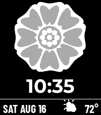

# White Lotus

A Pebble Time 2 watchface built around the White Lotus tile from *Avatar: The
Last Airbender* — the Pai Sho tile the Order of the White Lotus uses as its
sign. The flower fills the top of the screen, the time sits under it, and a
strip across the bottom carries the day, date and weather.



## The artwork is traced, not generated

The first version of this face generated the flower parametrically: rings of
petals swept out from a width profile, with a couple of exponents to tune the
petal shape. It could be made to look like *a* lotus. It could not be made to
look like *the* tile, and no amount of tuning was going to get there, because
the real one is not a generic mandala:

- **eight** petals, not a dozen or more
- each one heart-shaped, with a deep **V-notch at the outer tip**
- sitting on a **scalloped pale backing** that follows their outline — that
  halo is most of what makes it read as this flower and not another
- around a **seed pod of small dots**: a ring of twelve, a ring of six, one in
  the middle

So the art is traced from the reference instead. `tools/source/white_lotus_tile.png`
is the tile icon from the [Avatar Wiki](https://avatar.fandom.com/wiki/Pai_Sho),
which is flat vector-style art in exactly three colours plus a transparent
surround — which downscales cleanly, so tracing costs nothing in quality and is
exact.

```sh
python3 tools/build_assets.py   # tile, weather icons, menu icon
python3 tools/mockup.py         # preview.png, and the layout fit checks
```

The show's tile is wood: dark brown ground, cream backing, terracotta petals.
Black and white keeps that three-tone structure rather than flattening it — the
petals stay one step darker than the backing they sit on, which is what
separates them from each other. The recolour happens at full resolution, before
the downscale, so the Lanczos filter blends between the final tones rather than
between the source's browns. Every channel is then snapped to Pebble's
64-colour palette (channels in {0, 85, 170, 255}).

Two things about the source are worth knowing before touching
`build_assets.py`:

- It is drawn with a **soft near-white halo just outside the disc**. In plain
  RGB distance those pixels are far closer to the cream backing than to the
  brown ground, so classifying by nearest colour alone puts the halo in the
  flower and the measured flower bounding box comes back as the entire canvas.
  `classify()` rejects anything whose channels span less than `MIN_CHROMA`
  first: the three real tones span 81, 130 and 144, the halo spans 9 to 60.
- The art is scaled to the **flower**, not to the tile's disc. On the wooden
  tile the flower sits inside a wide brown ground, which would cost about 30px
  of an already short screen — and once that ground is black it is the same
  black as the window behind it, so it is 30px that cannot be seen. The disc
  runs off the top and bottom of the bitmap instead. What this gives up is the
  tile's edge: the face reads as the emblem on black rather than as a tile held
  up to the camera.

## Layout

Everything is drawn by one update proc in `src/c/lotus.c`, in three bands: the
flower bitmap down to y=146, the time under it, and the strip from y=196. The
`LAYOUT` block at the top of that file has every coordinate.

The time is **below** the flower rather than on it. The tile's centre is the
seed pod — the single feature that identifies it as the White Lotus tile at all
— so putting the time there would mean drawing over the one part of the artwork
worth having. In exchange the time gets the full screen width instead of a chord
across the middle of a disc, which is why it can be 38px.

`tools/mockup.py` measures the fits that can silently overflow and exits
non-zero if any slack goes negative, so run it after changing a font size,
`ART_H`, or `INFO_TEMP_W`:

```
time  23:58  103x29  in band 200x48  slack +97 wide +19 tall
band  146..194  strip at 196  slack  +2
date  WED SEPT 30 104  in strip 116  slack +12
temp  100°         34  in  36       slack  +2
```

## Weather

`src/pkjs/index.js` runs on the phone, unchanged from the Aang face. It reads
the phone's location and asks [Open-Meteo](https://open-meteo.com) for the
current temperature and WMO weather code, which it collapses onto one of eight
icons. Open-Meteo needs no API key and no account, so the face works as soon as
it is installed.

The watch asks for a refresh every 30 minutes, and again whenever the bluetooth
link comes back. The last reading is persisted, so it is on screen immediately
after a restart rather than blank until the phone answers.

Temperature is in Fahrenheit. To switch, change `UNITS` at the top of
`src/pkjs/index.js` to `'celsius'` and rebuild — the watch only ever receives a
number.

Battery is a gauge in the top right. The bluetooth icon only appears when the
watch is disconnected, with a double buzz when the link drops.

## Building

```sh
pebble build
pebble install --emulator emery     # emulator
pebble install --cloudpebble        # the watch
```

Installing to hardware goes through CloudPebble: enable Dev Connect in the
Pebble app (Devices → ⋯ → Enable Dev Connect, sign in with GitHub), then
`pebble login` on your machine so both ends share an account.

`pebble install --emulator` does not switch the running emulator to a newly
installed watchface — it will keep showing whichever face it was already on.
`pebble kill` first if the screenshot looks like somebody else's watchface.

Only `emery` (Pebble Time 2) is in `targetPlatforms`. The artwork and the layout
are both sized for 200x228; adding another platform means regenerating the art
at that size and a second set of layout constants.

## Credits and licensing

The White Lotus and Pai Sho are Nickelodeon's, and the traced source art is from
the Avatar Wiki. This is a personal watchface for my own watch — don't republish
it to the app store.

Two fonts are bundled, both under the SIL Open Font License 1.1:

- the time is Montserrat Bold by Julieta Ulanovsky et al.
  (`resources/fonts/OFL-Montserrat.txt`)
- the info strip is Barlow Condensed Bold by Jeremy Tribby
  (`resources/fonts/OFL-BarlowCondensed.txt`). It is condensed because the
  widest date the clock can produce has to fit beside the weather without being
  truncated.
